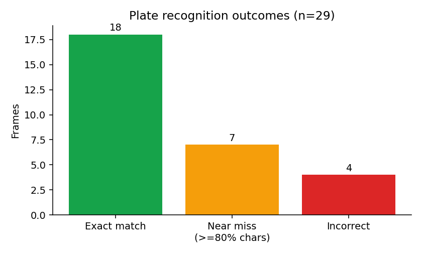
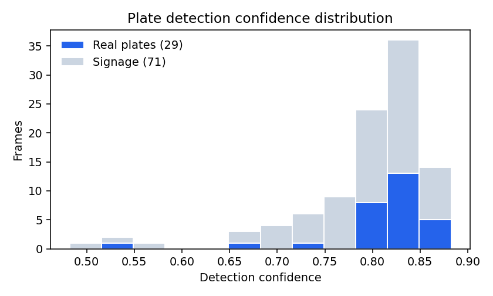
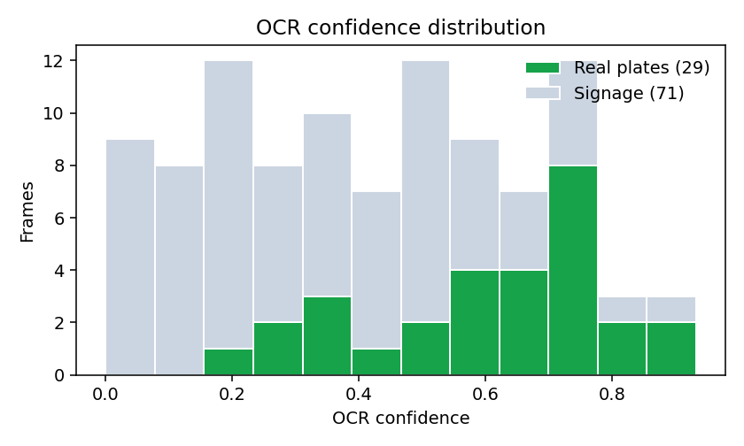
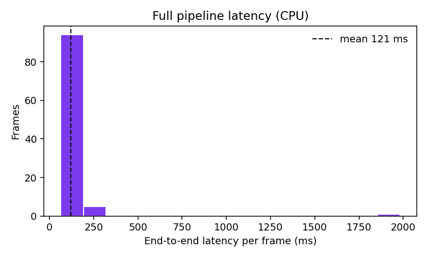

# ANPR-Based Vehicle Access Control System

Automatic Number Plate Recognition for gate access control. A YOLO11n detector
(exported to ONNX, CPU-only) locates the number plate in a frame, EasyOCR reads
the characters, and the plate is matched against a vehicle registry to produce a
**GRANTED / DENIED / UNKNOWN** verdict — every decision logged with the cropped
plate image as evidence.

FastAPI backend, React dashboard, PostgreSQL. Runs entirely on localhost.

---

## Problem Statement

Manual vehicle entry control at gated premises — campuses, apartment complexes,
office parks — depends on a guard reading each number plate and checking it
against a register. This is slow at peak hours, error-prone at night or in poor
weather, and produces no reliable audit trail: paper registers are rarely
complete and cannot be searched after an incident.

An automated system must therefore do four things that a camera alone cannot:
**locate** the plate within a full vehicle frame, **read** it accurately enough
to be actionable, **decide** access against an authoritative registry, and
**record** the decision with visual evidence so a human can audit and correct it
later. The engineering difficulty sits in the first two: Indian plates vary
widely in font, spacing, single- vs two-line layout, mounting angle, and
illumination, and a naive detector returns a dozen overlapping boxes for one
plate.

## Objectives

1. Train a single-class plate detector accurate enough for real gate footage,
   and export it to ONNX so the runtime needs no PyTorch.
2. Build a detection → OCR pipeline that returns exactly one box per plate,
   handling two-line plates in correct reading order.
3. Match recognised plates against a vehicle registry and classify each event as
   granted, denied, or unknown.
4. Persist every event — plate text, both confidence scores, cropped image — in
   a queryable access log.
5. Let an operator correct a misread plate, storing the correction *alongside*
   the model's original output so it accumulates as retraining data.
6. Present all of it in a dashboard usable without training: live feed, searchable
   logs, and registry management.
7. Keep the OCR stage behind a single-function interface so the engine can be
   replaced without touching anything else.

## Dataset Used

The detector was trained in [`notebooks/ANPR_Train_Detector_Colab.ipynb`](notebooks/ANPR_Train_Detector_Colab.ipynb).
The notebook supports two interchangeable sources; **the shipped model was
trained on Path A**, with all three Kaggle datasets merged into a single pool.
Path B is documented as a working alternative but was not used.

**Path A — Kaggle (Indian plates)**

| Dataset | Slug |
| --- | --- |
| Indian License Plates with Labels (~2 000 images, YOLO labels) | [`kedarsai/indian-license-plates-with-labels`](https://www.kaggle.com/datasets/kedarsai/indian-license-plates-with-labels) |
| Indian Vehicle Dataset | [`saisirishan/indian-vehicle-dataset`](https://www.kaggle.com/datasets/saisirishan/indian-vehicle-dataset) |
| Indian Number Plates Dataset | [`dataclusterlabs/indian-number-plates-dataset`](https://www.kaggle.com/datasets/dataclusterlabs/indian-number-plates-dataset) |

**Path B — Roboflow Universe (≈10 000 general plates) — alternative, not used here**

[`roboflow-universe-projects/license-plate-recognition-rxg4e`](https://universe.roboflow.com/roboflow-universe-projects/license-plate-recognition-rxg4e), version 4, YOLOv8 export.

The notebook downloads whichever path you configure, auto-detects the annotation
format (YOLO `.txt`, Pascal VOC `.xml`, 4-point polygon, or COCO `.json`),
converts everything to single-class YOLO format (`0 = plate`), and merges the
sources into one pool.

After format conversion and de-duplication the three Kaggle sets yielded a pool
of **1 743 usable annotated images**. The notebook's configured cap of 2 500 was
therefore never reached — the pool was the binding constraint, not the cap. That
pool was split with `SEED = 42`:

| Split | Images | Purpose |
| --- | --- | --- |
| Train | 1 397 | gradient updates |
| Validation | 246 | per-epoch mAP, early stopping (`patience=15`) |
| **Holdout** | **100** | never seen in training *or* validation — all reported results |

The holdout is committed to this repository as
[`backend/demo_frames/`](backend/demo_frames/) and is the evaluation set for
every number in [Results](#results). Holding out a third split, rather than
reporting validation scores, matters here: validation data influenced early
stopping, so validation mAP is an optimistic estimate. Every figure below comes
from data that touched no part of training.

> **Note on the holdout.** Only **29 of the 100** holdout images contain a real
> vehicle plate. The remaining 71 are scraped number-plate *dealer signage* —
> shop hoardings and advertising boards. They are retained deliberately: they are
> genuine hard negatives that show how the system behaves on plate-shaped objects
> that are not plates. All recognition accuracy figures are reported against the
> 29-image real-plate subset, with hand-verified ground truth in
> [`backend/scripts/ground_truth.csv`](backend/scripts/ground_truth.csv) — see
> [A note on the ground truth](#a-note-on-the-ground-truth).

## Technologies / Libraries Used

| Layer | Stack |
| --- | --- |
| Detection | YOLO11n (Ultralytics), exported to ONNX opset 12 |
| Inference runtime | `onnxruntime` 1.20 — CPU execution provider |
| OCR | EasyOCR 1.7 (English) |
| Image processing | OpenCV 4.10 (`opencv-python-headless`), NumPy 1.26 |
| API | FastAPI 0.115, Uvicorn, Pydantic v2 |
| Database | PostgreSQL 16 via SQLAlchemy 2.0 ORM |
| Frontend | React 18, Vite 5, GSAP 3 (animation), plain CSS |
| Infrastructure | Docker Compose (Postgres only) |
| Training | Google Colab (T4 GPU), Ultralytics, PyTorch |
| Evaluation | Matplotlib 3.9 |

The runtime deliberately avoids PyTorch for detection — that is the entire point
of the ONNX export. PyTorch does appear in the installed environment because
EasyOCR hard-depends on it; see [A note on PyTorch](#a-note-on-pytorch).

## Methodology

### 1. Training

`yolo11n.pt` fine-tuned for 60 epochs at 640×640, batch 16, `lr0=0.001` (low,
because training starts from pretrained COCO weights), `patience=15`, AMP
enabled. Augmentation: horizontal flip 0.5, rotation ±10°, perspective 0.0005,
HSV value 0.5 for day/night brightness variation, mosaic 1.0. Vertical flip is
explicitly disabled — an upside-down plate is not a plate.

The exported ONNX is verified against the PyTorch model on 10 holdout images
before use; silent export breakage is a known failure mode.

### 2. Image Preprocessing

**Detector input** — resize to 640×640, BGR→RGB, scale to `[0,1]`, transpose to
NCHW, add batch dimension, `float32`. Shape `[1, 3, 640, 640]`.

**OCR input** — the crop is upscaled to a 96 px height with cubic interpolation
and converted to greyscale. 96 px was measured as the optimum on the holdout
set: 128 px over-smooths the strokes, 64 px loses stroke detail.

### 3. Detection and Post-processing

Raw ONNX output is `[1, 5, 8400]`, transposed to 8 400 rows of
`cx, cy, w, h, confidence` in input-pixel coordinates. Rows are filtered at
`confidence > 0.25`, then passed through `cv2.dnn.NMSBoxes(..., 0.25, 0.45)`.

**Non-Maximum Suppression is essential here** — without it a single plate yields
8–13 overlapping boxes. With it, 94 of the 100 holdout frames collapse to exactly
one box; the remaining 6 return two, and no frame returns more. Surviving boxes
are rescaled to the original frame dimensions and clamped to its bounds before
cropping.

### 4. Character Recognition

EasyOCR returns one or more text boxes per crop. These are sorted **top-to-bottom,
then left-to-right within each line**, grouping boxes into lines when their
vertical centres fall within 0.6 × box height of each other. This ordering is
what makes two-line plates work: without it, `MH02` above `BT6482` is emitted as
`BT6482MH02`. Text is uppercased, stripped to `[A-Z0-9]`, and confidence is
averaged across boxes weighted by character count.

The entire OCR stage sits behind one function —
`read_plate(crop) -> (text, confidence)` in
[`backend/app/inference/recognizer.py`](backend/app/inference/recognizer.py).
Nothing outside that file imports or names EasyOCR, so replacing it with a custom
CRNN means rewriting one file.

### 5. Access Decision

Exact string match against the `vehicles` table:

| Condition | Decision |
| --- | --- |
| Plate in registry **and** `is_authorized = true` | `granted` |
| Plate in registry **and** `is_authorized = false` | `denied` |
| Plate not in registry | `unknown` |
| No plate detected | `no_detection` |

No fuzzy or Levenshtein matching — a near-match on a security decision is a
wrong answer, not a helpful one.

### 6. Logging and Correction

Every processed frame writes an `access_logs` row with the plate text, detection
and OCR confidences, the decision, and paths to the saved crop and frame. An
operator can correct a misread plate from the Logs page; the correction is stored
in `corrected_plate` **alongside** the model's original reading, never
overwriting it. That pairing is exactly the labelled data a retraining run needs.

### Architecture

```
Frame ──> detector.py ──> pipeline.py ──> recognizer.py ──> routers/anpr.py
          ONNX + NMS      orchestration   EasyOCR seam      decision + log
                                                                  │
   React dashboard <──── FastAPI JSON <──── PostgreSQL <──────────┘
```

The ONNX session and the EasyOCR reader are both constructed **once at import**,
and `ANPRPipeline` is instantiated once in the FastAPI `lifespan` handler and
kept on `app.state`. Loading per request turns 80 ms into 2 s.

### Database Schema

```
vehicles      id, plate_number (unique, indexed), owner_name, phone,
              vehicle_type, is_authorized, created_at

access_logs   id, plate_number, vehicle_id -> vehicles.id, direction,
              decision, det_confidence, ocr_confidence, crop_path,
              frame_path, corrected_plate, created_at (indexed)
```

Tables are created automatically at startup — no migration tool.

---

## Steps to Execute the Project

### Prerequisites

- **Python 3.11** — required. The pinned `numpy==1.26.4` and `easyocr==1.7.2`
  have no wheels for Python 3.13/3.14 and will fail to build.
- Node 18+
- Docker (for PostgreSQL)

### 0. Model weights

The trained detector ships with this repository at
`backend/app/weights/plate_detector.onnx` (YOLO11n, ~10 MB). Nothing to do —
it is cloned along with everything else.

Confirm it is present and valid before starting the backend:

```bash
python -c "import onnxruntime as ort; \
s = ort.InferenceSession('backend/app/weights/plate_detector.onnx'); \
print(s.get_inputs()[0].shape, s.get_outputs()[0].shape)"
# expect: [1, 3, 640, 640] [1, 5, 8400]
```

To retrain it from scratch instead: open
[`notebooks/ANPR_Train_Detector_Colab.ipynb`](notebooks/ANPR_Train_Detector_Colab.ipynb)
in Google Colab, set a T4 GPU runtime, fill in your Kaggle or Roboflow API key in
the CONFIG cell, and run top to bottom (~60 min). Cell 14 packages the ONNX for
download.

### 1. Database

```bash
docker compose up -d
```

PostgreSQL listens on **localhost:5436** (not 5432 — that port was taken by
another local project). To change it, edit `docker-compose.yml` and
`backend/.env` together.

### 2. Backend

```bash
cd backend
python3.11 -m venv .venv
source .venv/bin/activate          # macOS / Linux
# .venv\Scripts\activate           # Windows

pip install -r requirements.txt
cp .env.example .env

python scripts/seed_demo.py        # creates the 10 demo vehicles
python -m uvicorn app.main:app --reload --port 8000
```

First startup takes ~40 s while EasyOCR downloads its weights into `~/.EasyOCR/`.
Subsequent starts take a few seconds.

API docs: <http://localhost:8000/docs>

### 3. Frontend

```bash
cd frontend
npm install
npm run dev
```

Open <http://localhost:5173>.

### 4. Verify it works

```bash
curl -X POST http://localhost:8000/api/anpr/demo-frame \
  -H "Content-Type: application/json" \
  -d '{"filename":"car-wbs-HR26CT4063_00000.jpg"}'
```

Expected: plate `HR26CT4063`, decision `denied`.

### 5. Reproduce the results

```bash
cd backend
pip install -r requirements-eval.txt
python scripts/evaluate.py
```

Runs all 100 holdout frames and writes to `results/`: annotated output images,
performance graphs, `metrics.md`, and per-frame `predictions.csv`.

### Troubleshooting

**Port 8000 already in use.** Uvicorn binds IPv4 `127.0.0.1:8000`. If another
service (a Docker container, for instance) holds `*:8000` on IPv6, requests to
`localhost:8000` may resolve to `::1` and reach the wrong application while
uvicorn appears to start normally. Test with `http://127.0.0.1:8000` explicitly,
or check with `lsof -nP -iTCP:8000 -sTCP:LISTEN`.

**`pip install` fails building numpy or easyocr.** You are not on Python 3.11.
Check with `python --version` inside the activated venv.

**Backend exits at startup with an onnxruntime error.** `plate_detector.onnx` is
missing or corrupt — see [Step 0](#0-model-weights).

### Using the dashboard

**Live** — "Start feed" walks the demo frames one every 2 s, showing each verdict
as a colour-coded card. "Upload image" runs any file you drop in. Both write to
the access log.

**Logs** — every processed frame, newest first. Filter by decision, search by
plate, correct a misread plate inline.

**Registry** — add, edit, and delete vehicles; toggle `is_authorized` to block a
vehicle without deleting it.

Plates that demonstrate each verdict:

| Decision | Demo frame | Plate |
| --- | --- | --- |
| `granted` | `59e121dc-...-Autopsyches-Skoda-Laura-6.jpg.jpg` | DL3CAY2231 |
| `denied` | `car-wbs-HR26CT4063_00000.jpg` | HR26CT4063 |
| `unknown` | `video11_1030.jpg` | MH47Y1124 |

### API Reference

| Method | Path | Purpose |
| --- | --- | --- |
| POST | `/api/anpr/process` | multipart image → detect, read, decide, log |
| GET | `/api/anpr/demo-frames` | list available demo frames |
| POST | `/api/anpr/demo-frame` | `{ filename }` → process that demo image |
| GET | `/api/logs` | `?limit=&decision=&plate=` |
| PATCH | `/api/logs/{id}/correct` | `{ corrected_plate }` |
| GET | `/api/vehicles` | list |
| POST | `/api/vehicles` | create |
| PATCH | `/api/vehicles/{id}` | update |
| DELETE | `/api/vehicles/{id}` | delete |
| GET | `/api/stats` | today's counts by decision |

---

## Results

All figures below were **measured on this repository**, not copied from the
training run. Reproduce them with `python scripts/evaluate.py`, which writes
[`results/`](results/) — annotated outputs, graphs, `metrics.md`, and per-frame
`predictions.csv`. Hardware: Apple Silicon CPU, no GPU.

### Detector training metrics

Reported by Ultralytics at the end of training, against the 246-image validation
split (recorded in `model_info.txt`):

| Metric | Value |
| --- | --- |
| mAP@50 | 0.9834 |
| mAP@50-95 | 0.8193 |
| Precision | 0.9834 |
| Recall | 0.9681 |

### A note on the ground truth

`scripts/demo_plates.csv` — the plate list produced by the training notebook —
is **not** reliable ground truth. It was generated by running EasyOCR over the
holdout frames, so scoring against it measures agreement between two OCR runs
rather than accuracy.

It is demonstrably wrong on **8 of the 29** real plates (28%). Ten holdout frames
carry their true plate in the filename (`car-wbs-MH12DE1433_00000.jpg`), which
makes the errors verifiable independently:

| `demo_plates.csv` says | Actually | Error |
| --- | --- | --- |
| `NP32KN7325` | UP32KN7325 | N → U |
| `MH2OCS4946` | MH20CS4946 | letter O → digit 0 |
| `WH42DE1433` | MH12DE1433 | W → M, 4 → 1 |
| `HO5DS8679` | MH05DS8679 | dropped leading M |
| `MH47H2829` | MH47N2829 | H → N |
| `KI12BT6482` | MH02BT6482 | three characters |
| `KH02BT6482` | MH02BT6482 | K → M |
| `MK0IBT0050` | MH01BT0050 | K → H, I → 1 |

All 29 real plates were therefore re-labelled by hand into
[`scripts/ground_truth.csv`](backend/scripts/ground_truth.csv) — 7 confirmed from
filenames, 22 read visually from upscaled crops. **Every accuracy figure below is
scored against that file.** Scoring against the original CSV instead would have
reported 72%, overstating real performance by 10 points.

### Detection

| Metric | Value |
| --- | --- |
| Frames producing a detection | **100 / 100 (100%)** |
| Frames with exactly 1 box after NMS | 94 |
| Maximum boxes on any frame | 2 |
| Mean detection confidence | 0.795 |

### Recognition — 29 real-plate frames

| Metric | Value |
| --- | --- |
| **Exact plate match** | **18 / 29 (62%)** |
| **Mean character accuracy** | **91.6%** |
| Near misses (≥80% characters correct) | 7 |
| Mean OCR confidence | 0.605 |

### Latency — full pipeline, CPU

| Metric | Value |
| --- | --- |
| Mean per frame | 119 ms |
| 95th percentile | 182 ms |

### Interpretation

**Detection is effectively solved on this data.** Every frame yields a box, mean
confidence 0.795, and NMS reduces the 8–13 raw proposals to a single box on 94%
of frames. The detector is not the bottleneck.

**Recognition is the bottleneck, and the gap between the two accuracy figures is
the whole story.** 62% of plates are read perfectly, but mean character accuracy
is 91.6% — meaning most failures are *one or two characters* in an otherwise
correct read, not garbage output. Every miss is a confusion between visually
similar glyphs:

| Confusion | Example |
| --- | --- |
| `M` → `H` / `V` / `N` | MH47N4570 → VH47N4570 |
| `0` → `O`, `1` → `I` | MH20CS4946 → MH2OCS4946 |
| `6` → `8` | MH02BT6482 → MH02BT8482 |

Because exact match is what gates an access decision, a single confused character
turns an authorised vehicle into `unknown`. That is why the system logs
`corrected_plate` separately from the model's reading: each operator correction
captures one of these confusions as labelled retraining data aimed precisely at
the characters the model gets wrong.

One failure is not a confusion at all but a parsing bug: `MH14EU3498` is read as
`INDHH14EU3498`, because the plate's blue "IND" country strip is inside the crop
and gets concatenated. Stripping a leading `IND` is a small, targeted fix worth
roughly 3 percentage points.

**Latency is dominated by OCR.** At ~119 ms mean per frame the system is
comfortably real-time for gate use, where a vehicle is stationary for seconds.

### Sample outputs

[`results/samples/`](results/samples/) holds annotated detections for all 29
real-plate frames plus two signage hard negatives — each showing the predicted
box, the plate text, both confidence scores, and the expected value. Graphs are
in [`results/graphs/`](results/graphs/), and the full 100-frame set regenerates
into `results/outputs/` with `python scripts/evaluate.py`.






---

## Limitations and Future Scope

**Current limitations**

- Exact-match only — a single misread character produces `unknown` for an
  authorised vehicle.
- OCR exact-match accuracy of 62% is below what unattended gate operation needs,
  though character accuracy is 91.6% — most failures are one confused glyph.
- Single-frame processing; no video input or multi-frame voting.
- CPU-only, ~119 ms per frame — fine for a gate, not for highway-speed capture.
- No authentication on the dashboard.
- Evaluated on 29 real-plate images, which is a small test set.

**Future scope**

- Replace EasyOCR with a CRNN trained specifically on Indian plates — addresses
  the accuracy *and* the latency bottleneck simultaneously.
- Multi-frame voting from a video stream: aggregate reads across consecutive
  frames of the same vehicle to suppress single-frame errors.
- Confidence-gated review queue — route low-confidence reads to a human instead
  of rejecting them.
- Retraining loop consuming accumulated `corrected_plate` data.
- GPU inference and authentication for production deployment.

---

## A note on PyTorch

`requirements.txt` does not list PyTorch, but **installing EasyOCR pulls in
`torch` and `torchvision` anyway** — EasyOCR hard-depends on them and there is no
torch-free install path. The detector genuinely runs on `onnxruntime` alone; the
torch dependency comes entirely from the OCR side. Because
`recognizer.py` is the only file that touches EasyOCR, replacing it removes
PyTorch from the project completely.

## Repository Structure

```
├── notebooks/
│   └── ANPR_Train_Detector_Colab.ipynb   # training + ONNX export (Colab)
├── backend/
│   ├── app/
│   │   ├── inference/{detector,recognizer,pipeline}.py
│   │   ├── routers/{anpr,logs,vehicles}.py
│   │   ├── db/{models,session}.py
│   │   └── weights/plate_detector.onnx   # trained detector (committed)
│   ├── demo_frames/                      # 100 held-out evaluation images
│   ├── scripts/
│   │   ├── evaluate.py                   # regenerates everything in results/
│   │   ├── seed_demo.py
│   │   ├── ground_truth.csv              # hand-verified plates (scoring)
│   │   └── demo_plates.csv               # notebook's OCR output (unreliable)
│   └── requirements.txt
├── frontend/src/
│   ├── pages/{Live,Logs,Registry}.jsx
│   └── components/
├── results/
│   ├── graphs/                           # performance charts
│   ├── samples/                          # annotated sample outputs
│   ├── metrics.md                        # results tables
│   └── predictions.csv                   # per-frame raw numbers
├── model_info.txt
└── docker-compose.yml
```
